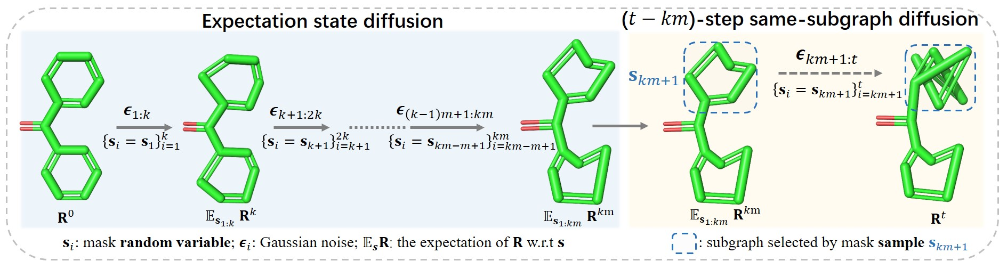
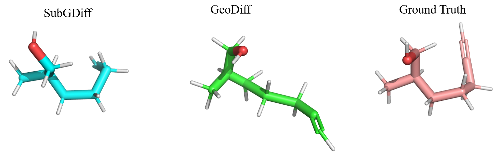

# SUBGDIFF: A Subgraph Diffusion Model to Improve Molecular Representation Learning

The official implementation of the NeurIPS 2024 paper [SubgDiff: A Subgraph Diffusion Model to Improve Molecular Representation Learning](https://arxiv.org/abs/2405.05665).
```
@inproceedings{zhang2024subgdiff,
  title={SubgDiff: A Subgraph Diffusion Model to Improve Molecular Representation Learning},
  author={Zhang, Jiying and Liu, Zijing and Wang, Yu, Feng, Bin and Li, Yu},
  booktitle={Advances in Neural Information Processing Systems},
  year={2024}
}
```
<div align="center">

</div>


<!--  -->
## Environments


### Dependency
```
python=3.7

pytorch                   1.11.0          py3.7_cuda11.3_cudnn8.2.0_0 
torch-cluster             1.6.0                    pypi_0    
torch-geometric           1.7.2                    pypi_0  
torch-scatter             2.0.9                    pypi_0   
torch-sparse              0.6.13                   pypi_0 

rdkit                     2023.3.2                 pypi_0
```
other useful packages  in my enviroment: see `env.txt` / `env.yaml`


## Dataset

The dataset can directly download from [https://zenodo.org/records/10616999](https://zenodo.org/records/10616999)

### Offical Dataset


The offical raw GEOM dataset is avaiable [[here]](https://dataverse.harvard.edu/dataset.xhtml?persistentId=doi:10.7910/DVN/JNGTDF).


### Prepare your own GEOM dataset from scratch (optional)

You can also download origianl GEOM full dataset and prepare your own data split. A guide is available at previous work GeoDiff's [[github page]](https://github.com/MinkaiXu/GeoDiff).

## Training

All hyper-parameters and training details are provided in config files (`./configs/*.yml`), and free feel to tune these parameters.

You can train the model with the following commands:

- QM9 dataset
```bash
# Default settings

sh train.sh

```

## Generation


You can generate conformations for entire or part of test sets by:

`One can use the commands to generate new samples:
```bash
sh test.sh
```

Here `start_idx` and `end_idx` indicate the range of the test set that we want to use. All hyper-parameters related to sampling can be set in `test.py` files. Following GeoDiff, the `start_idx=800` and `end_idx=100` in our experiments.

Conformations of some drug-like molecules generated by SubGDiff can see `visulization.ipynb`

## Evaluation

After generating conformations following the obove commands, the results of all benchmark tasks can be calculated based on the generated data.

### Conformation Generation

The `COV` and `MAT` scores on the GEOM datasets can be calculated using the following commands:

Evaluation on generated samples:
```bash
python eval_covmat.py checkpoints/qm9_500steps/samples/samples_all.pkl
python eval_covmat.py checkpoints/qm9_200steps/samples/samples_all.pkl
```


## Visualizing molecules with PyMol

- molecules visulization: 
 
 Run `visualization.ipynb`

- molecules trajectory generation (--save_traj)

```bash
python test.py --ckpt checkpoints/qm9_500steps/2000000.pt --config checkpoints/qm9_500steps/qm9_500steps.yml --test_set './data/GEOM/QM9/test_data_1k.pkl' --start_idx 800 --end_idx 1000 --sampling_type same_mask_noisy --n_steps 500 --device cuda:1 --w_global 0.1 --clip 1000 --clip_local 20 --global_start_sigma 5 --tag SubGDiff500 --save_traj
```

Run `visualization.ipynb`.


## Subgraph diffusion process

Please see the `Class SubgraphNoiseTransform` in `utils/transforms.py`


## Visualization
### Sampling trajectory of SubGDiff (ours)
The video suggests that the denoising network will only denoise the atomic coordinates from a subgraph at each timestep during the sampling process.


### Sampling trajectory of GeoDiff

The video indicates that the denoising network will denoise all atomic coordinates  at each timestep during the sampling process.


### Visualization of final sampling results
The following figures come from the final step of the sampling trajectory above (SubGDiff and GeoDiff).   From the figures, we can see that our SubGDiff can generate a more similar conformation to the ground truth.




## Acknowledgement

This repo is built upon the previous work Geodiff's [[codebase]](https://github.com/MinkaiXu/GeoDiff). 
